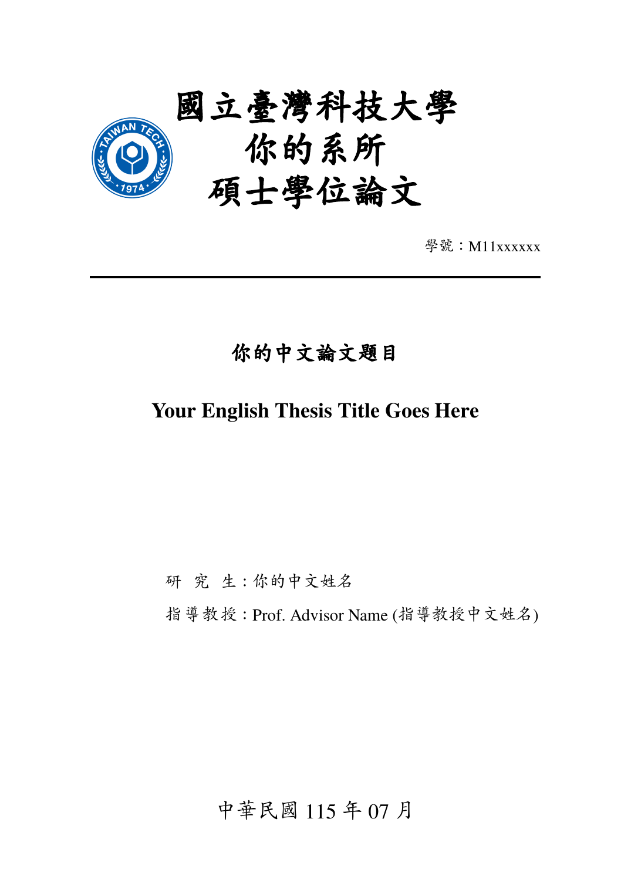

# NTUST Thesis LaTeX Template

An unofficial, community LaTeX thesis template for **National Taiwan University of
Science and Technology (NTUST / 國立臺灣科技大學)** master's and PhD theses.
XeLaTeX + xeCJK, Overleaf-ready, with a CI-built PDF and placeholders plus worked
examples to start from.

[](https://github.com/fadhilrp/ntust-thesis-template/actions/workflows/build.yml)
[](LICENSE)
[](LICENSE-CLASS)

<p align="center">
  
</p>

> This is a community template, not an official NTUST product. Always check the
> current formatting rules from your department and the NTUST library before you
> submit. If you spot a mismatch with the official spec, please
> [open an issue](../../issues).

## Quick start: Overleaf (no install)

1. On this repo, click **Code ▾ → Download ZIP**.
2. In Overleaf: **New Project → Upload Project**, and drop the ZIP.
   *(Overleaf's "Import from GitHub" is a premium feature; the ZIP path is free.)*
3. Open the project **Settings** (the gear icon, or **File → Settings**), then in the
   **Compiler** section set:
   - **Compiler:** `XeLaTeX` (required, since Chinese does not render under pdfLaTeX).
   - **TeX Live version:** the newest available (2025/2026).
   - **Main document:** `my_ntust_thesis.tex`.
4. Click **Recompile**. You should get the placeholder thesis PDF. Now edit the
   files listed below.

## Quick start: local

```bash
git clone https://github.com/fadhilrp/ntust-thesis-template.git
cd ntust-thesis-template
latexmk -xelatex my_ntust_thesis.tex     # the .latexmkrc forces XeLaTeX + bib passes
```

Or grab the freshly built PDF from the **Actions** tab → latest run → `thesis-pdf`
artifact, without installing anything.

## Prerequisites (local only; Overleaf needs none)

- **TeX Live 2023+** (or MiKTeX) with the **XeLaTeX** engine and `latexmk`.
- **Fonts** for the default profile:
  - `TeX Gyre Termes`, ships with TeX Live, nothing to install.
  - `AR PL UKai TW`, Debian/Ubuntu: `sudo apt-get install fonts-arphic-ukai`
    (macOS with Homebrew: `brew install font-ar-pl-ukai-tw` or install a Kai font
    and adjust the name). See [`fonts/README.md`](fonts/README.md) for details and
    an offline/self-contained option.

## What you edit

| File / folder | What it is | Edit it? |
|---|---|---|
| `frontpages/my_names.tex` | Title, author, advisor, department, dates (drives the cover & title page) | Yes |
| `frontpages/my_eabstract.tex` | English abstract | Yes |
| `frontpages/my_cabstract.tex` | Chinese abstract | Yes |
| `frontpages/my_ackn.tex` | Acknowledgements | Yes |
| `sections/*.tex` | Your chapters | Yes |
| `backpages/my_appendix.tex` | Appendices | Yes |
| `backpages/my_vita.tex` | Curriculum vitae (optional) | Yes |
| `my_bib.bib` | Your references (BibTeX) | Yes |
| `my_ntust_thesis.tex` | Main file: fonts + the list of chapters to include | Light edits |
| `ntust_report.cls`, `frontpages/ntust_*`, `backpages/ntust_*`, `common_env.tex`, `watermark/` | The NTUST format machinery | No (leave as is) |

## Filling in the placeholders

- **Metadata** → `frontpages/my_names.tex`. Every cover/title-page field lives here,
  including the Chinese (ROC-calendar) and English oral-examination dates. Read the
  comments at the top of that file.
- **Chapters** → add a file under `sections/` and `\input` it in
  `my_ntust_thesis.tex` (see the commented examples there).
- **References** → add BibTeX entries to `my_bib.bib` and cite with `\cite{key}`.
  `my_bib.bib` ships with one example of each common entry type.

## The signed forms (Recommendation & Qualification)

NTUST requires the first pages to be **Cover → Recommendation Form → Qualification
Form** (no blank page). Those forms are generated for you by the NTUST system and
signed after your oral exam, so they are **not** part of this template. When you
have your signed scans:

1. Save them as `frontpages/recommendation.pdf` and `frontpages/qualification.pdf`.
2. Uncomment the two `\includepdf` lines in the **SIGNED FORMS** block of
   `frontpages/ntust_frontpages.tex`.

They will be inserted right after the title page. (These PDFs are git-ignored so you
never commit personal signatures.)

## Fonts & portability

Under XeLaTeX, fonts are resolved **by name via the OS font database**, not the TeX
Live tree. The default profile (`TeX Gyre Termes` + `AR PL UKai TW`) is chosen
because both resolve on Overleaf out of the box. `my_ntust_thesis.tex` also contains
two commented alternatives: (a) the university-exact `Times New Roman` + `cwTeXKai`,
and (b) a fully self-contained profile that loads bundled fonts by path. See
[`fonts/README.md`](fonts/README.md).

## Watermark

The NTUST body-page watermark is **off by default**, which is what the library's
ETD upload expects (the ETD system adds its own watermark and PDF security on
upload). To turn it on for drafts, uncomment the watermark `\input` line in
`common_env.tex`.

## FAQ / troubleshooting

- **`Fatal Package fontspec Error: ... requires either XeTeX or LuaTeX` / "No PDF
  produced".** Your project is compiling with pdfLaTeX. On Overleaf, open **Settings**
  (gear icon, or **File → Settings**) → **Compiler → XeLaTeX**, then Recompile.
  Locally: `latexmk -xelatex my_ntust_thesis.tex`.
  (Overleaf picks the engine from the Compiler menu, not from `.latexmkrc`, so this
  must be set once per project.)
- **Chinese shows as boxes.** Same cause: use **XeLaTeX**.
- **"Font ... not found" locally.** Install the default-profile fonts (see
  Prerequisites), or switch to the bundled font profile in `my_ntust_thesis.tex`.
- **Citations show as `[?]`.** Run the bib pass. `latexmk` does this automatically,
  and on Overleaf you just Recompile once more. Do not delete `\bibliography{my_bib}`.
- **Overleaf uses the wrong main file.** Settings (gear icon, or File → Settings) →
  **Main document** → `my_ntust_thesis.tex`.
- **`minted` / shell-escape.** Not used here (Overleaf disables shell-escape); the
  template uses `listings` for code.

## License

- **Template content** (the `.tex` skeleton, examples, docs, config): **MIT**, see
  [`LICENSE`](LICENSE).
- **Document class** `ntust_report.cls` (descends from `report.cls`, adapted for
  NTUST): **LPPL 1.3c**, see [`LICENSE-CLASS`](LICENSE-CLASS).
- **Fonts**, if you bundle any, keep their own upstream licenses.

## Acknowledgements

This template builds on earlier work:

- **Derivation chain.** This template is derived from
  [hadziq/ntust-thesis](https://github.com/hadziq/ntust-thesis), which was itself
  derived from the **Yuan Ze University** thesis template. Thanks to Hadziq and the
  Yuan Ze template's authors. A related Overleaf/Docker fork is
  [hsiangjenli/ntust-thesis-latex](https://github.com/hsiangjenli/ntust-thesis-latex).
- **Document class.** `ntust_report.cls` descends from LaTeX's `report.cls`
  (the LaTeX Project, LPPL), adapted for the NTUST thesis format.
- **Fonts.** TeX Gyre Termes (GUST) and AR PL UKai (Arphic/Firefly).

## Contributing

Issues and PRs welcome, see [`CONTRIBUTING.md`](CONTRIBUTING.md) and
[`CODE_OF_CONDUCT.md`](CODE_OF_CONDUCT.md). Tip: after pushing, enable **Template
repository** in the repo Settings so others get a "Use this template" button, and
turn on **Issues** and **Discussions**.
